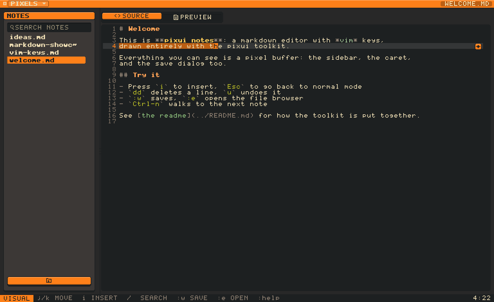
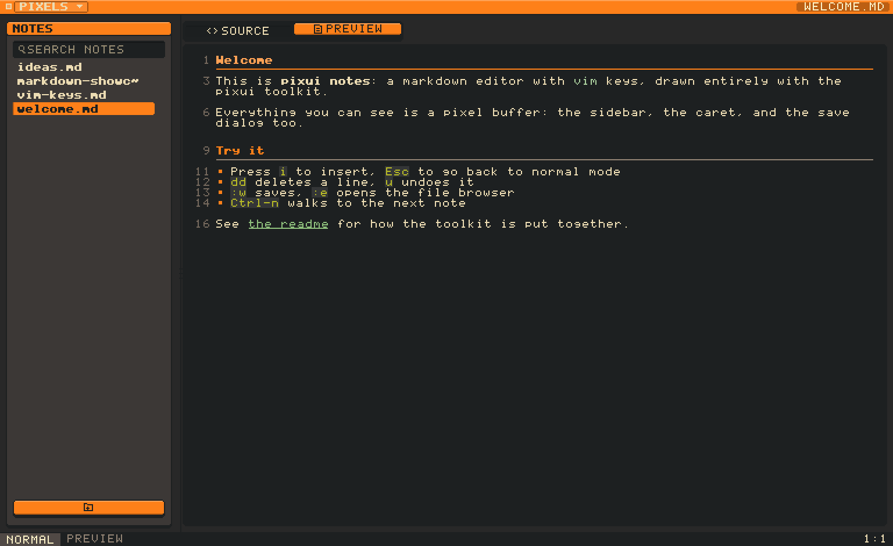
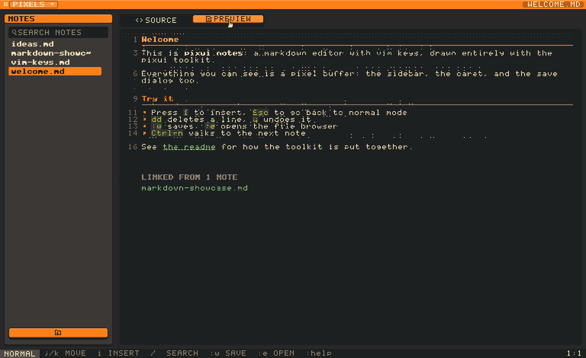
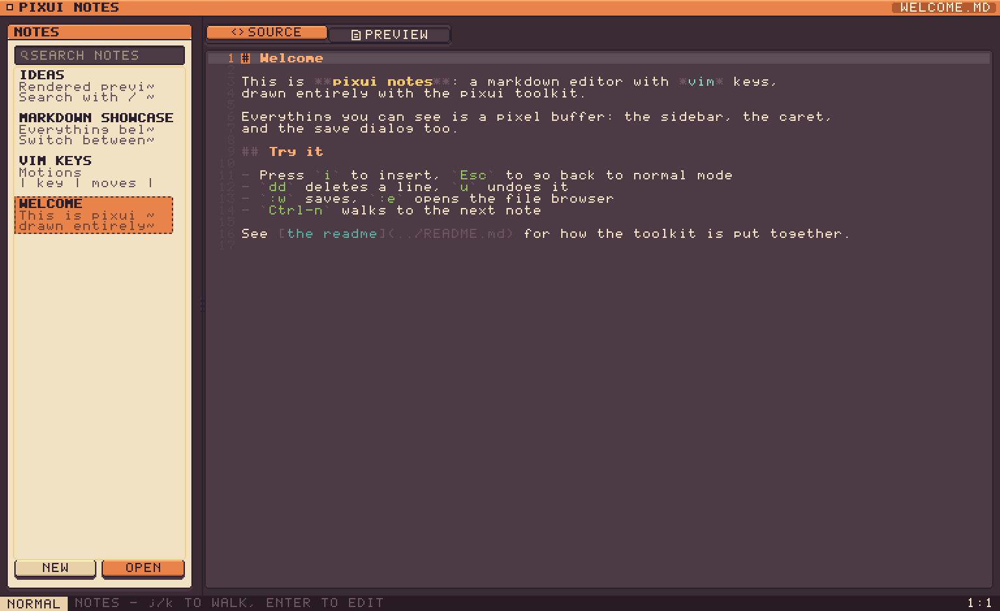
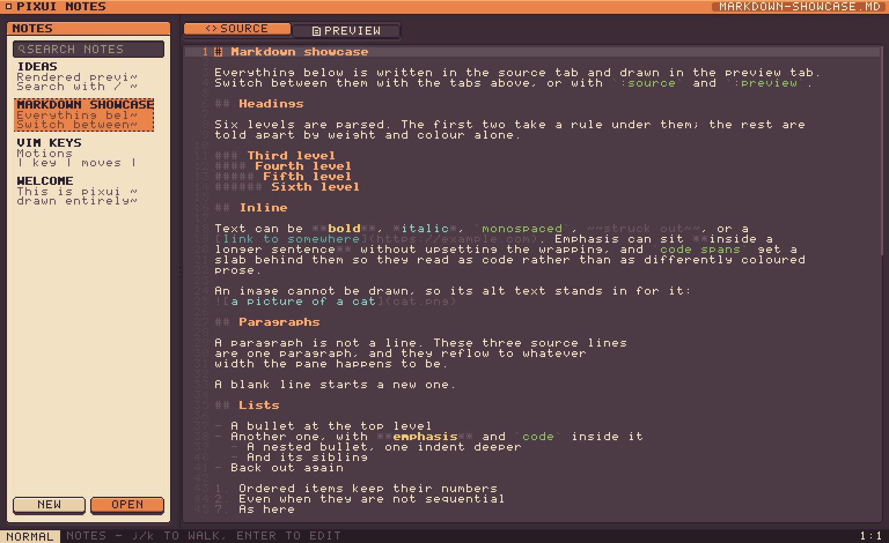
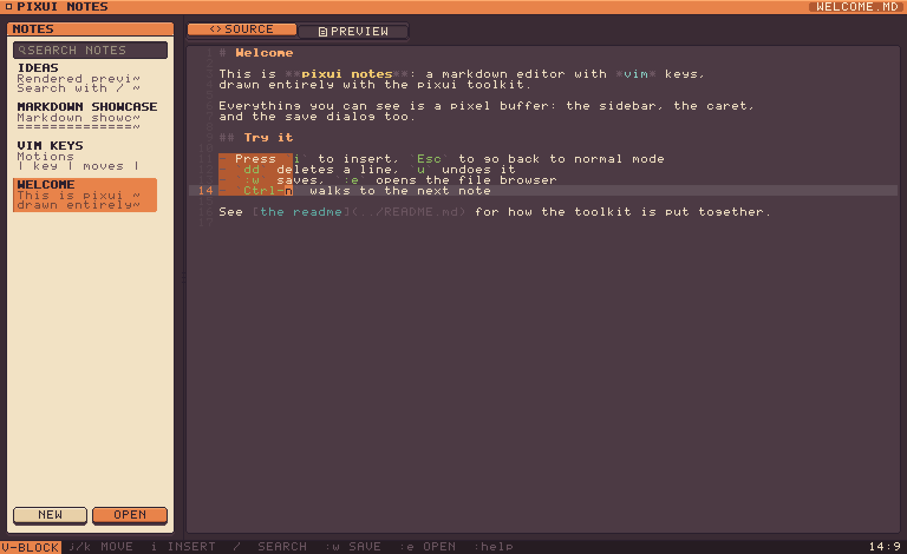
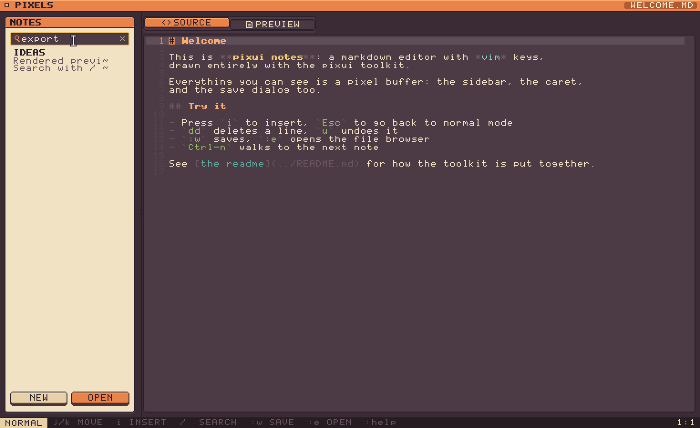
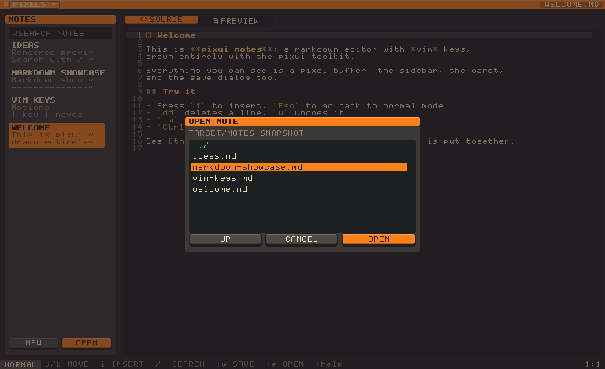

# notes

A markdown note editor with vim keys, drawn one pixel at a time.

Every pixel on screen is software-rendered into a small buffer and magnified by
a whole number — the sidebar, the caret, the file dialogs and the mouse pointer
included. Nothing is borrowed from the platform.


```sh
cargo run --release
```

Notes live in `./notes` and are seeded on first run. Point `PIXUI_NOTES_DIR`
somewhere else to use a real vault.

## Two views of a note

The source view highlights markdown as you type it, and hands fenced code to
a real grammar — [syntect](https://github.com/trishume/syntect)'s, remapped
onto the sixteen colours here rather than dragging its own theme in. The
preview renders the document: paragraphs reflow, markup disappears, tables
become tables. Switch with `cmd-1` and `cmd-2` (Ctrl off macOS), with
`:preview` and `:source`, or by clicking the tabs — `<>` for the source, a
folded page for the rendering. The shortcut takes a modifier because bare
digits are vim's counts, and `2j` has to keep meaning two lines down.

| source | preview |
|---|---|
|  |  |

Tables size to their content, fenced code keeps its own slab and is never
re-wrapped, task lists get real checkboxes, and links lose their targets. The
Links in the preview are clickable: one naming another note opens it, and one
with a scheme goes to the desktop to be opened. The seeded **Markdown
showcase** note exercises the lot — open it and flip between
the tabs. Switching dissolves one view into the other: every pixel takes one
side or the other by an ordered dither, because sixteen colours have nothing
in between to fade through. The tabs themselves ride the same spring the
buttons do, so the one you pick rises out of the strip as the other sinks.



In insert mode the caret pulses instead of blinking — the density of an
ordered dither, since a sixteen-colour palette has no half-brightness to fade
through. Typing restarts it solid.


## Panes

`cmd-e` puts the keyboard in the editor, `cmd-n` in the note list, `cmd-s` in
the search box. Moving it is signposted: a ring lands on the pane that took
the keys and dissolves, and the list's own outline fades in behind it. In the list, `j` and `k` walk the notes that the filter is
actually showing, and `Enter` drops back into the text. Command specifically,
not Control — Control is vim's.

| arriving | settled |
|---|---|
|  |  |

## Vim

| | |
|---|---|
| **Motions** | `h j k l`, `w b e`, `0 ^ $`, `gg G`, `f F t T` with `;` `,`, counts |
| **Editing** | `i I a A o O`, `x`, `D`, `C`, `p P`, `u`, `Ctrl-r` |
| **Operators** | `d c y` with any motion, doubled for linewise |
| **Text objects** | `iw aw`, `ip ap`, `i" i' i\``, `i( i[ i{ i<` and `a` variants |
| **Visual** | `v` charwise, `V` linewise, `Ctrl-v` blockwise; `I`/`A` on a block type once and apply to every row |
| **Search** | `/` `?`, `n` `N`, `*` for the word under the cursor |
| **Commands** | `:w`, `:e`, `:q`, `:qa`, `:new`, `:preview`, `:source`, `:help` |

Normal mode is *parsed*, not switch-cased, because vim's grammar really is one:
`[count] operator [count] motion`. Keystrokes accumulate and are re-parsed on
each key, which is why `3dw`, `d3w`, `dd`, `2dd` and `dG` all fall out of a
single code path — and why `d` on its own is a prefix that waits rather than an
error that beeps.



## The rest of it

The mouse works too: click to place the caret, drag to select, double-click a
note in the drawer to rename it, drag the divider to resize the sidebar.

| | |
|---|---|
|  |  |

The file dialogs are not the system's. They browse the filesystem, scroll, take
keyboard navigation and dim what is behind them — and they are built from the
same buttons and lists as everything else.

`Cmd`/`Ctrl` with `+`, `-` and `0` scales the whole UI, in whole pixels.
Resizing the window buys more room rather than bigger pixels.

## Built on pixui

`pixui/` is the toolkit underneath: a software rasteriser, a 5x7 bitmap font, an
immediate-mode widget set, and a swappable presenter with CPU (softbuffer) and
GPU (wgpu) backends. It is a path dependency of this app rather than the point
of the repo, and `pixui/README.md` covers it properly.

```sh
cargo run --release -- --shots                 # regenerate screenshots/
cargo test --workspace                         # 188 tests
PIXUI_PROFILE=1 cargo run --release            # live frame breakdown
```

## Not implemented

Marks, macros, named registers, regular expressions in search (patterns are
literal), tag objects, keyboard scrolling of the preview, setext headings,
reference links, nested block quotes, inline HTML, and any script the built-in
ASCII font cannot draw. Images are parsed but cannot be drawn, so their alt text
stands in for them.

## Licence

MIT OR Apache-2.0
