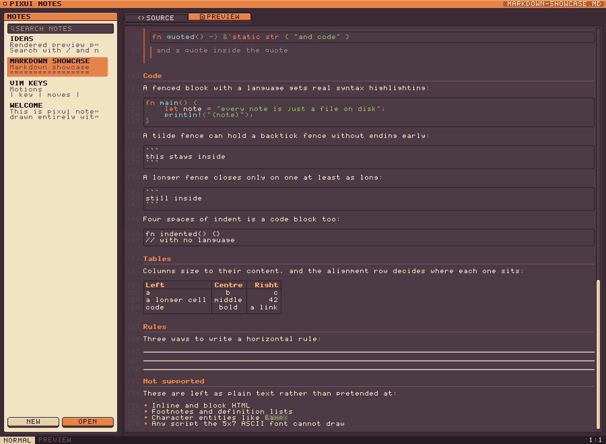
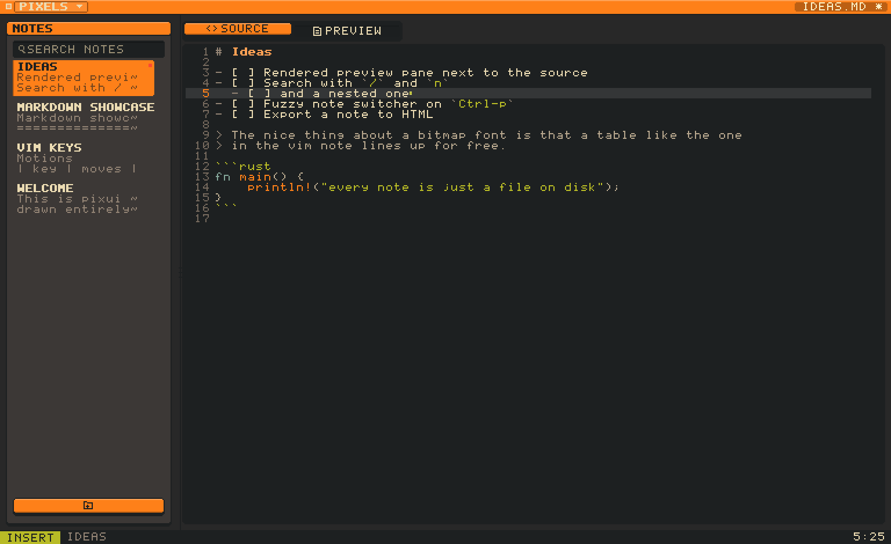
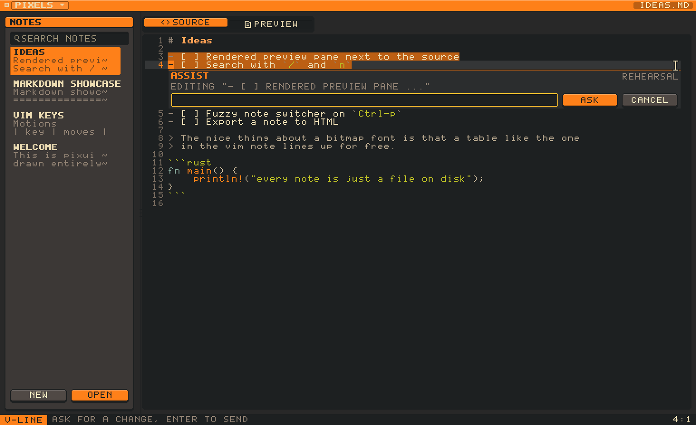
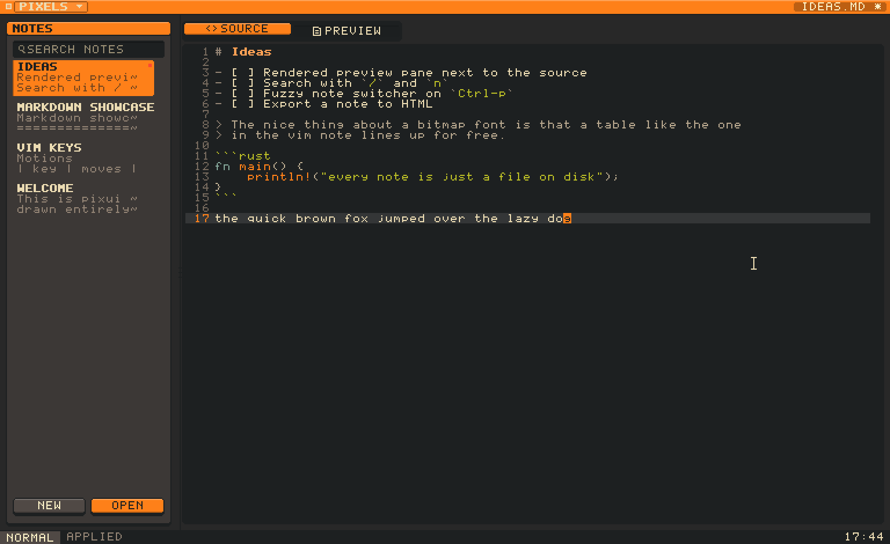

# notes

A markdown note editor with vim keys, drawn one pixel at a time.

Every pixel on screen is software-rendered into a small buffer and magnified by
a whole number — the sidebar, the caret, the file dialogs and the mouse pointer
included. Nothing is borrowed from the platform.


```sh
cargo run --release
```

Notes live in `./notes` and are seeded on first run. Point `PIXUI_NOTES_DIR`
somewhere else to use a real vault.

## Two views of a note

The source view highlights markdown as you type it, and hands fenced code to
a real grammar — [syntect](https://github.com/trishume/syntect)'s, remapped
onto the sixteen colours here rather than dragging its own theme in. The
preview renders the document: paragraphs reflow, markup disappears, tables
become tables. Switch with `cmd-1` and `cmd-2` (Ctrl off macOS), with
`:preview` and `:source`, or by clicking the tabs — `<>` for the source, a
folded page for the rendering. The shortcut takes a modifier because bare
digits are vim's counts, and `2j` has to keep meaning two lines down.

| source | preview |
|---|---|
|  |  |

### What it understands

Both forms of heading, ATX and underlined. Emphasis with either `*` or `_`,
single, double or triple, nesting properly so `**bold with an *italic* word**`
is both. Strikethrough. Code spans, including ones fenced by several backticks
so they can hold a backtick. Backslash escapes. Links inline, by reference
(full, collapsed and shortcut), as autolinks, and as bare URLs written in
running prose. Images. Lists — bullet, ordered, and task — nested, with items
that run over several lines and blank lines between them. Block quotes holding
anything a document can hold, including other quotes, lazily continued. Code
fenced with backticks or tildes, or indented four spaces. Tables with per-
column alignment. Horizontal rules. Hard line breaks, both ways of writing one.

Not supported, and left as plain text rather than pretended at: inline and
block HTML, footnotes and definition lists, character entities, and any script
the 5x7 ASCII font cannot draw.

Tables size to their content, fenced code keeps its own slab and is never
re-wrapped, task lists get real checkboxes, and links lose their targets.
Links in the preview are clickable: one naming another note opens it, and one
with a scheme goes to the desktop to be opened. The seeded **Markdown
showcase** note exercises the lot — open it and flip between the tabs. It is
installed into any vault that has not got it, and it doubles as the parser's
test fixture, so a construct cannot be claimed there without being parsed. Switching dissolves one view into the other: every pixel takes one
side or the other by an ordered dither, because sixteen colours have nothing
in between to fade through. The tabs themselves ride the same spring the
buttons do, so the one you pick rises out of the strip as the other sinks.


In insert mode the caret closes toward its own middle and opens back out
instead of switching on and off: at eight pixels tall, a bar that simply
vanishes reads as a dropped frame, where two ends travelling to meet each other
is a blink you can watch happen. Typing restarts it at full height.

Both views are numbered down the same gutter, and both carry the same
scrollbar in the same place, so flipping between them does not shift the page.
The preview's numbers are the *source* lines its blocks were parsed from — a
rendering has no lines of its own to count, since a paragraph is one block
however many rows it wraps into, so the only number that means anything is
where the block came from. Everything that *is* a row somebody typed gets its
own number: every item of a list, every line of a code block, every row of a
table, and everything inside a quote. What cannot is a wrapped row and a blank
line, for the same reason the source view puts a tick rather than a number
beside a continuation.

The preview scrolls with the vim motions that move a page: `j k`,
`Ctrl-d Ctrl-u`, `Ctrl-f Ctrl-b`, `Ctrl-e Ctrl-y`, `gg`, `G`, space, and the
wheel. The keys that move a caret are not taken, because there is no caret
there to move — except `/`, `n` and `N`, which are vim's search and belong to
the note rather than to the view of it. A search finds a line in the source,
scrolls the preview to the block that line was parsed into, and lights up every
hit in the rendered text; the source view lights up the same pattern, so a
search made in either view is answered in both.


Headings have six levels and the font has one size, so the ladder is built out
of everything else: the top three rule themselves off — full width, full width,
then only as wide as the words — the last gives up its weight, and the colour
and the air above step down the whole way.




## Panes

`cmd-e` puts the keyboard in the editor, `cmd-n` in the note list, `cmd-s` in
the search box. A ring marks the region that just
took the keyboard and fades out again; the list's own outline fades in behind
it. Nothing moves — an arrival cue that travels has to cross whatever chrome
lies between where it starts and where it stops, and that reads as flicker. In the search box, `Down` steps into the
results, and so does `Enter`, which is the key the hand is already on after
typing; both stay put when nothing matched. `Escape` clears the term — a
second one leaves. In the list, `j`
and `k` walk the notes the filter is actually showing, and `Enter` drops back
into the text. Command specifically,
not Control — Control is vim's.

| arriving | settled |
|---|---|
|  |  |

## Vim

| | |
|---|---|
| **Motions** | `h j k l`, `w b e`, `0 ^ $`, `gg G`, `f F t T` with `;` `,`, counts |
| **Editing** | `i I a A o O`, `x`, `D`, `C`, `p P`, `u`, `Ctrl-r` |
| **Operators** | `d c y` with any motion, doubled for linewise |
| **Text objects** | `iw aw`, `ip ap`, `i" i' i\``, `i( i[ i{ i<` and `a` variants |
| **Visual** | `v` charwise, `V` linewise, `Ctrl-v` blockwise; `I`/`A` on a block type once and apply to every row |
| **Search** | `/` `?`, `n` `N`, `*` for the word under the cursor |
| **Commands** | `:w`, `:e`, `:q`, `:qa`, `:new`, `:preview`, `:source`, `:help` |
| **Indenting** | `Tab` a level in, `Shift-Tab` a level out |
| **Assistant** | `Ctrl-a` on a visual selection, or the mark in the margin |

A new line inherits where it is. Enter in a list opens the next item already
marked up — the same bullet, the next number, an unchecked box for a task, at
the nesting it found — and `o` and `O` do the same. Enter on an item holding
nothing but its marker takes the marker away instead, because a list you cannot
leave is worse than one you have to start twice. A quote carries its bar down,
and a list inside a quote continues as both. Inside a fenced code block the
markdown rules stop applying and the code's do: the indent carries, a line
ending in `:` or an opening bracket takes one more level, and a level is four
spaces rather than two. `Tab` and `Shift-Tab` move the whole line in or out by
one level, taking the caret with them.



Normal mode is *parsed*, not switch-cased, because vim's grammar really is one:
`[count] operator [count] motion`. Keystrokes accumulate and are re-parsed on
each key, which is why `3dw`, `d3w`, `dd`, `2dd` and `dG` all fall out of a
single code path — and why `d` on its own is a prefix that waits rather than an
error that beeps.


## The rest of it

The mouse works too: click to place the caret, drag to select, double-click a
note in the drawer to rename it, drag the divider to resize the sidebar.

| | |
|---|---|
|  |  |

The file dialogs are not the system's. They browse the filesystem, scroll, take
keyboard navigation and dim what is behind them — and they are built from the
same buttons and lists as everything else.

`Cmd`/`Ctrl` with `+`, `-` and `0` scales the whole UI, in whole pixels.
Resizing the window buys more room rather than bigger pixels.

## Built on pixui

`pixui/` is the toolkit underneath: a software rasteriser, a 5x7 bitmap font, an
immediate-mode widget set, and a swappable presenter with CPU (softbuffer) and
GPU (wgpu) backends. It is a path dependency of this app rather than the point
of the repo, and `pixui/README.md` covers it properly.

The assistant needed one thing the toolkit did not have: **layers**. Immediate
mode resolves interaction as each widget is visited, so a control drawn on top
of another is *painted* over it but asks about the pointer second — and by then
whatever is underneath has already said the click was for it. `ui.layer(rect,
…)` declares that everything inside floats above everything shallower, and
interaction is resolved against the layers the previous frame declared, which
for anything on screen long enough to be clicked is the same answer. It is what
makes the block's own buttons work while sitting inside a text view whose hit
test covers the whole pane.

```sh
cargo run --release -- --shots                 # regenerate screenshots/
cargo test --workspace                         # 273 tests
PIXUI_PROFILE=1 cargo run --release            # live frame breakdown
```

## The assistant

Select something in visual mode and a mark appears in the right margin, level
with the last line of the selection. Press it — or `Ctrl-a`, for hands that
never left the keyboard — and the text opens up under the selection to make
room for the question.

It sits *in* the note rather than over it. A panel floating beside the
selection covers the words either side of the one thing you are trying to
judge; a block opened between the lines pushes them apart instead, scrolls with
them, and leaves the note reading as a note with a question in it.

| asked | answered |
|---|---|
|  |  |

The answer comes back as a word-level diff: struck through in red where words
went, green where they arrived, and the note is not touched until **APPLY** is
pressed. **REJECT** throws it away. Asking again refines what is on screen
rather than starting over, so "now make it shorter" means shorter than the
suggestion you are looking at.



A line diff would be the wrong tool: a rewritten paragraph is one line in the
source, so a line diff would say "all of it changed" and leave you reading two
paragraphs to find the three words that moved. Words are the unit the
suggestion is actually made in.

The model runs on a worker thread and is spoken to through two channels.
Nothing waits on it: a request is posted, the frame carries on drawing at sixty
a second, and the answer is collected whenever it turns up.

### Which model

Two backends behind one trait. The default build has the **rehearsal** stub,
which fixes a handful of typos and collapses runs of spaces — enough to build,
test and screenshot the whole interaction without a gigabyte of weights, and
enough that the app still has an assistant when built without one. It says
`REHEARSAL` in the panel, because a stub that does not admit to being one is a
demo pretending to be a feature.

The real one is **Qwen3-1.7B**, quantised to four bits and run through
llama.cpp — on the machine in front of you, offline, no key and no account.
Build it in with `--features llm`, which compiles llama.cpp from source and so
wants `cmake` and `clang`, and fetch the weights:

```sh
mkdir -p models && curl -L -o models/Qwen3-1.7B-Q4_K_M.gguf \
  https://huggingface.co/ggml-org/Qwen3-1.7B-GGUF/resolve/main/Qwen3-1.7B-Q4_K_M.gguf
```

That is where it looks unless `PIXUI_MODEL` says otherwise; without it the build
falls back to the stub. The weights load on the first question rather than at
startup, so opening a note never waits on them. On Apple silicon the whole
model goes to the GPU and an edit takes a second or two.

There is a way to try it without the interface at all, which is also how to see
what it costs:

```sh
echo "some prose with an error in it" | cargo run --features llm -- --ask "fix the grammar"
```

A 1.7B model is good at proofreading, tightening and rephrasing — the jobs
where being local matters most, since the note never leaves the machine. It
wants a *concrete* instruction: "fix the grammar", "split into two sentences",
"say it as a pirate" all work, where "make it goofy" gets the text handed back
almost unchanged. At this size the model has no idea what you meant, and its
safest guess is the passage it was given. When that happens the block says so
and puts the question back in the field to be edited.

It is **not** good at checking facts: it has no way to look anything up, and it will
invent a correction with the same confidence it fixes a comma. That is the
reason for the diff and the two buttons.

## Not implemented

Marks, macros, named registers, regular expressions in search (patterns are
literal), tag objects, inline and block HTML, footnotes, definition lists,
character entities, and any script the built-in ASCII font cannot draw. Images
are parsed but cannot be drawn, so their alt text stands in for them.

## Licence

MIT OR Apache-2.0
