# notes

A markdown note editor with vim keys, drawn one pixel at a time.

Every pixel on screen is software-rendered into a small buffer and magnified by
a whole number — the sidebar, the caret, the file dialogs and the mouse pointer
included. Nothing is borrowed from the platform.

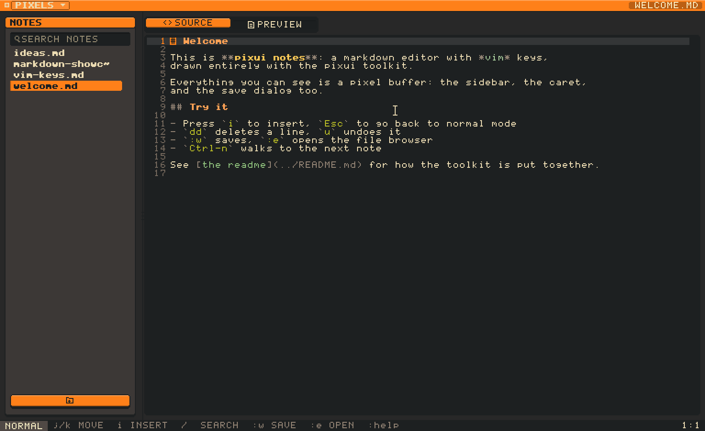

```sh
cargo run --release
```

Notes live in `./notes` and are seeded on first run; `PIXUI_NOTES_DIR` points
it at a real vault.

## What it does

**Editing** — vim, parsed rather than switch-cased, so `3dw`, `d3w`, `dd` and
`dG` all fall out of one grammar.

- Motions `h j k l`, `w b e`, `0 ^ $`, `gg G`, `f F t T` with `;` `,`, counts
- Operators `d c y` with any motion, doubled for linewise
- Text objects `iw aw`, `ip ap`, `i" i' i\``, `i( i[ i{ i<` and the `a` variants
- Visual charwise, linewise and blockwise; `I`/`A` on a block types once and
  applies to every row
- Search `/` `?`, `n` `N`, `*`, lighting the hits up as the pattern is typed;
  commands `:w :e :q :qa :new :preview :source`
- Undo and redo, a register that knows charwise from linewise from blockwise
- A new line inherits its list marker, its quote, or the indent of the code it
  is in; `Tab` and `Shift-Tab` move a line a level in or out

**Markdown** — two views of the same note, dissolving into each other.

- Headings both ways, emphasis nesting properly, strikethrough, code spans,
  escapes, links inline / by reference / autolinks / bare URLs, images, nested
  lists including tasks, quotes holding anything, fenced and indented code,
  tables with per-column alignment, rules, hard breaks
- Fenced code gets real syntax highlighting, from Sublime grammars
- Links in the preview are clickable; one naming another note opens it, and the
  foot of the page says which notes link *here* — the question a folder of files
  cannot answer
- Both views carry the same gutter and the same scrollbar, numbered with the
  same source lines
- `/` searches the preview and lights up every hit
- A note is written down a moment after you stop typing, so `:w` is what you
  press to be sure rather than what stands between you and losing an afternoon
- The clipboard is the system's: `y` and `d` put text on it, `p` takes whatever
  is on it, and `Cmd-c`/`Cmd-x`/`Cmd-v` are the same three for the hand that
  reaches for those instead

| finding a note | source | preview |
|---|---|---|
| 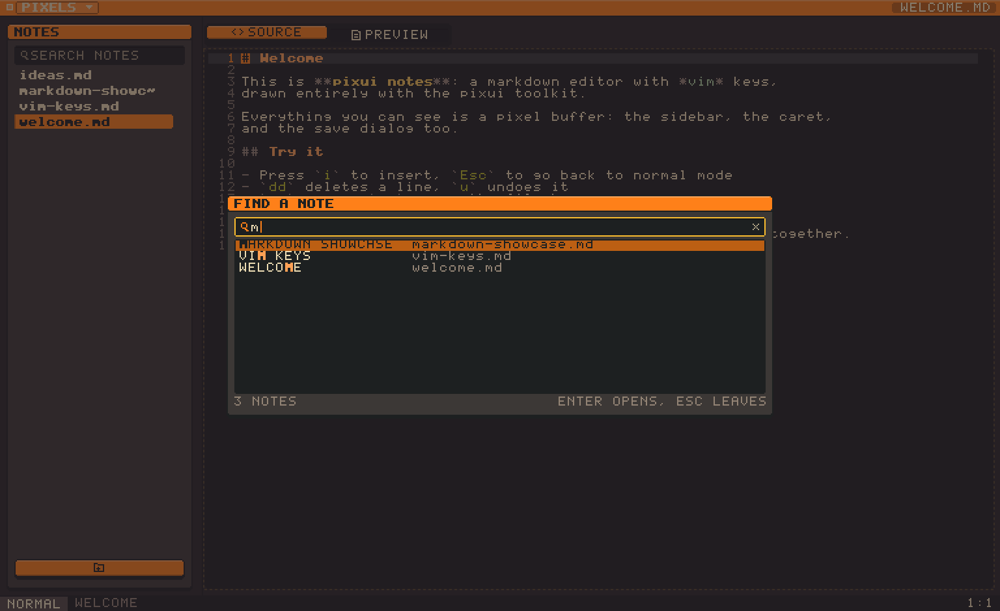 | 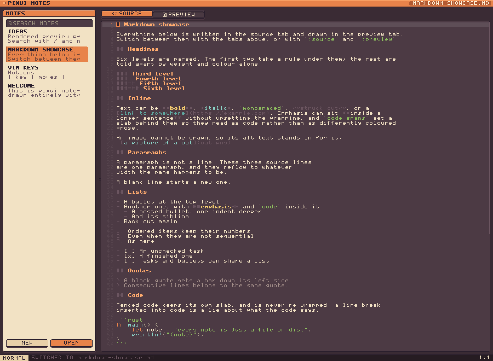 | 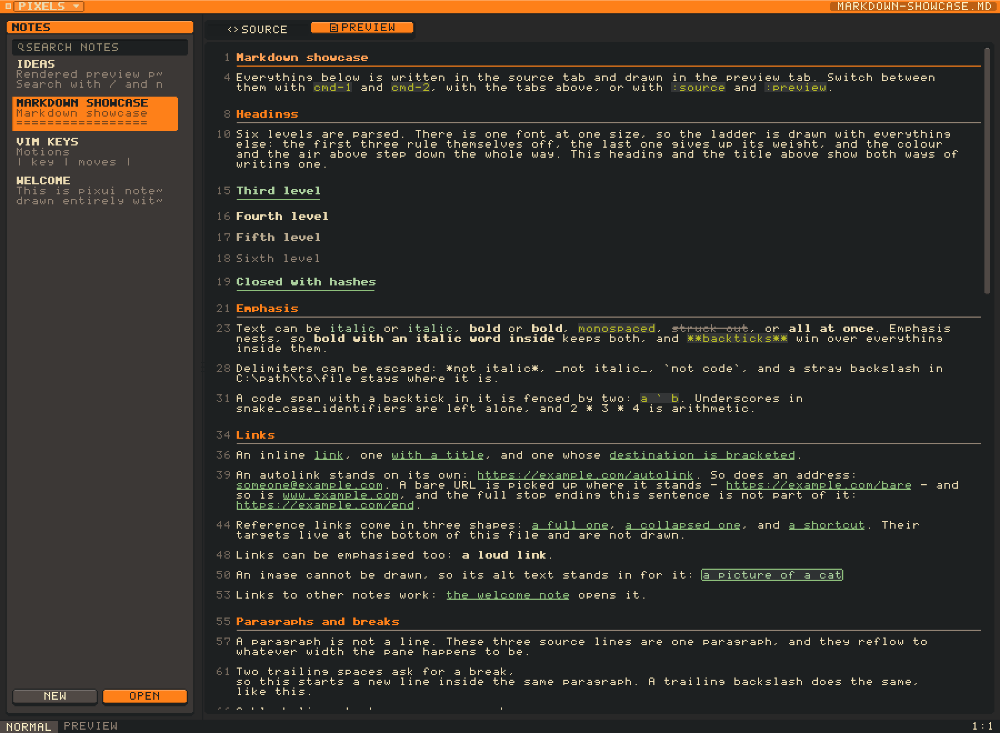 |

| the chats about a note | one of them | a change it offered |
|---|---|---|
| 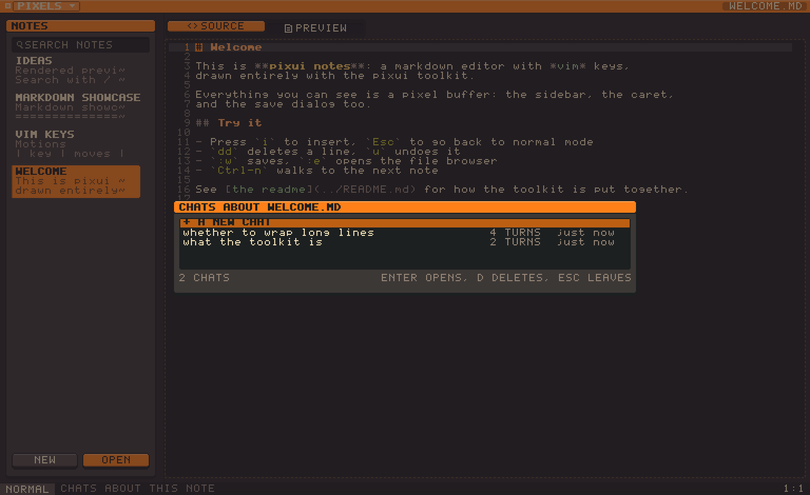 | 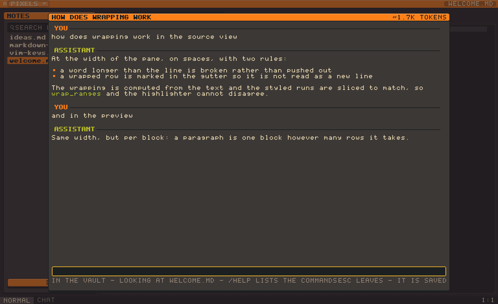 | 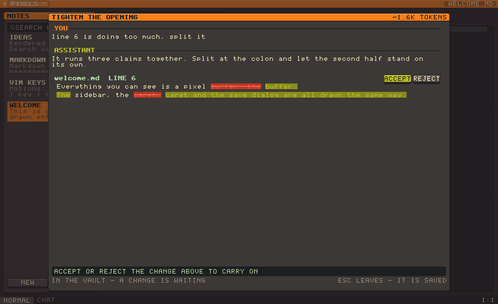 |

**Notes** — a forest of projects. A project is a folder of notes, drawn as a
tree with a heading you can fold, and a note lying loose at the top of the vault
stays where it is. Rows are filenames - the thing on disk, the thing a rename
renames, the thing the model is told to edit. The other mouse button on a note offers to rename or delete
it; on a project, to add a note as well — and deleting either asks first, in the
same menu, saying what it would take. Filtered as you type, `Ctrl-n`/`Ctrl-p` to
walk.
`Cmd-p` opens the whole library to a fuzzy search: `mdsh` finds
`markdown-showcase.md`, and the letters that answered are lit in the row.
`cmd-e`, `cmd-n` and `cmd-s` put the keyboard in the editor, the list or the
search box, and a ring says where it went. The file dialogs are not the
system's — they are built from the same widgets as everything else.

**An assistant, on your machine** — select something, press `Cmd-Enter`, and
ask for a change.

- Qwen3.5 35B or Ornith 1.5 9B through llama.cpp, on the GPU where there is one;
  no key, no account, and nothing leaves the machine unless you switch the next
  one on. Two rather than a list, because eleven were measured on a 24GB Mac and
  these are the two worth keeping — the reasoning is in `settings.rs`, with the
  table. The 35B is a surprise: only three of its thirty-five billion are awake
  for any one token, so it is the largest model here and also the fastest
- **Working sums out** rather than remembering them, and **knowing what the
  time and the date are**, which are two things a language model cannot do and
  does not know it cannot do. Both happen on the machine, so both are always on
- **Looking things up**, off by default: the weather anywhere, an encyclopaedia,
  the newest release of a project on GitHub, and any page you or it names. Real
  APIs rather than a scraped search engine, so there is still no key and no
  account. Every call it makes is written into the transcript beside the answer
- Prompts are built from each model's own chat template, so a family that
  spells its turns differently is spoken to correctly
- The window is sized per request, up to whatever the model was trained to
  read; the weights are put down again after a few minutes' quiet
- `Cmd-Enter` with nothing selected opens a conversation instead: the same
  context, no passage, and every chat is filed under the *project* it was had
  in - opened from any file in it you get the same conversations back, looking
  at whichever file you asked from. `/help` lists what can be typed, `/web`
  turns looking things up on and off without leaving the conversation, Tab
  finishes a half-typed command, and the title bar says what the last question
  came to in tokens
- A conversation sees the whole project - every file in the folder, numbered -
  and can propose changes to any of them: edit some lines, write a whole file,
  delete one, or merge several into one and take the rest away
- It proposes rather than writes: the reply carries a block against numbered
  lines, and you get the diff with **ACCEPT** and
  **REJECT** before anything moves. What you decided is written into the
  transcript, so a change taken today is a `+2 -1` summary tomorrow rather than
  a question asked twice. The field is held while one is waiting: a change
  offered is a question back, and it is answered before anything else is asked
- The question opens *in* the text, between the lines
- The answer arrives as a word-level diff, and the note is not touched until
  you keep it — `Cmd-Enter` again, or **APPLY**
- The answer arrives word by word rather than all at once, and **STOP** gives up
  on one you no longer want — what it had got to is what you keep. Reading the
  question is the slow half and it counts itself out loud, so the wait says how
  far along it is rather than that it is busy; stopping lands there too
- While it works, the window steps off the GPU rather than queueing behind it —
  see below
- Asking again refines the suggestion rather than starting over
- Settings fetches the weights for you, and can be switched off entirely

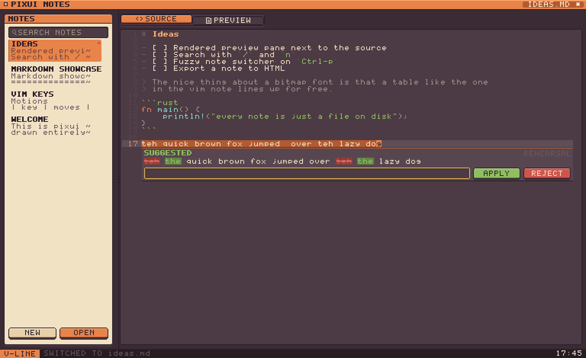

**Colour schemes** — nine, in the toolkit rather than the app, each taken from
its authors' own documentation: Warm, Midnight, Solarized Dark and Light,
Gruvbox Dark and Light, Nord, Dracula, Catppuccin Latte. `j` and `k` walk the
list and wear each one as they go.

**Fonts** — five bitmap faces, all drawn for low resolution: the toolkit's own
hand-drawn 5x7, [Creep2](https://github.com/raymond-w-ko/creep2) at 5x11,
[Tamzen](https://github.com/sunaku/tamzen-font) at 6x12,
[Cozette](https://github.com/the-moonwitch/Cozette) at 7x13, and
[Gohufont](https://github.com/hchargois/gohufont) at 8x14. They are baked
from their BDFs by `tools/bdf2rs.py`, so there is still no font engine — glyphs
are bits, laid out at authoring time and blitted at runtime. Every band, row,
gutter and control is sized from the line height, so changing the face changes
the shape of the whole app rather than overflowing it.

| choosing | worn |
|---|---|
| 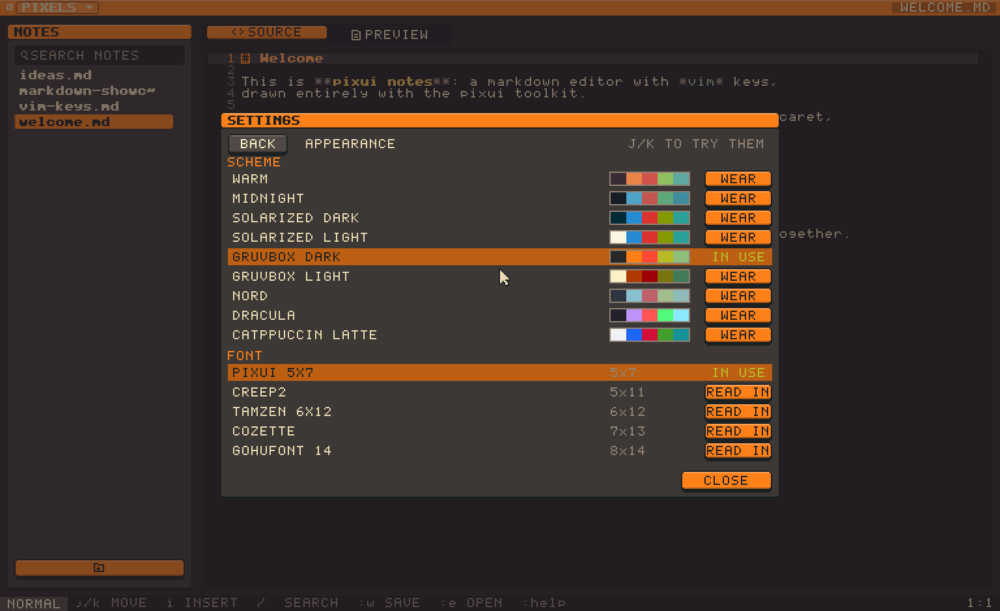 | 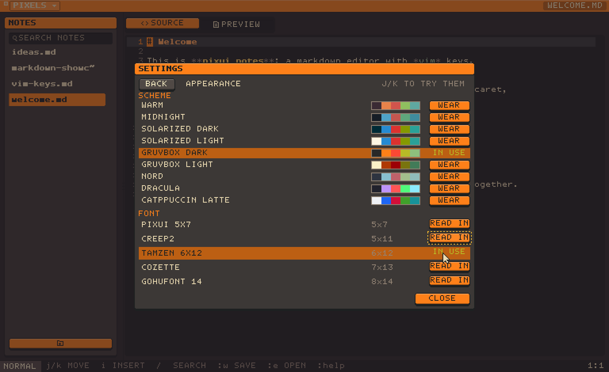 |
| 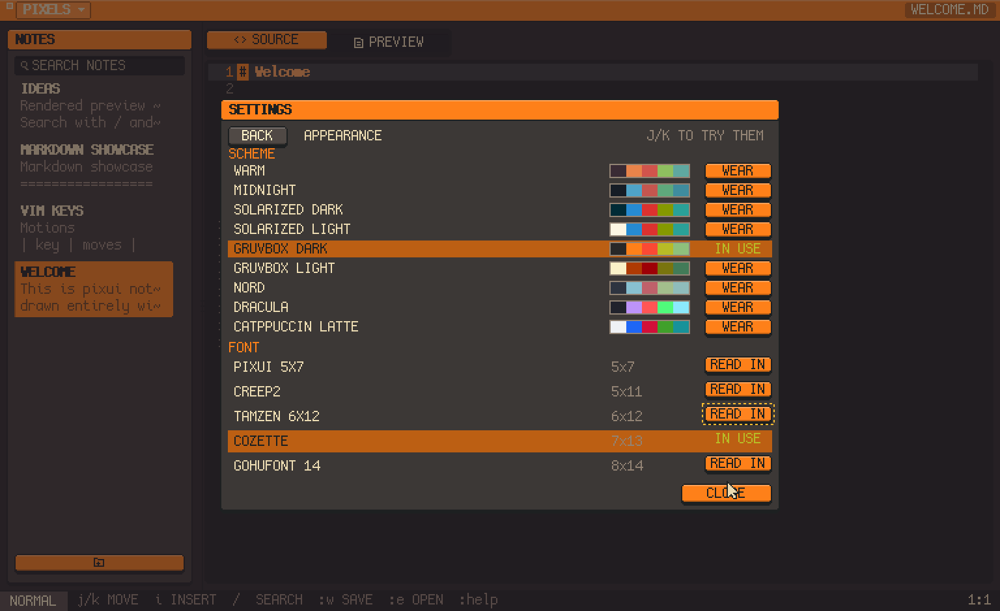 | 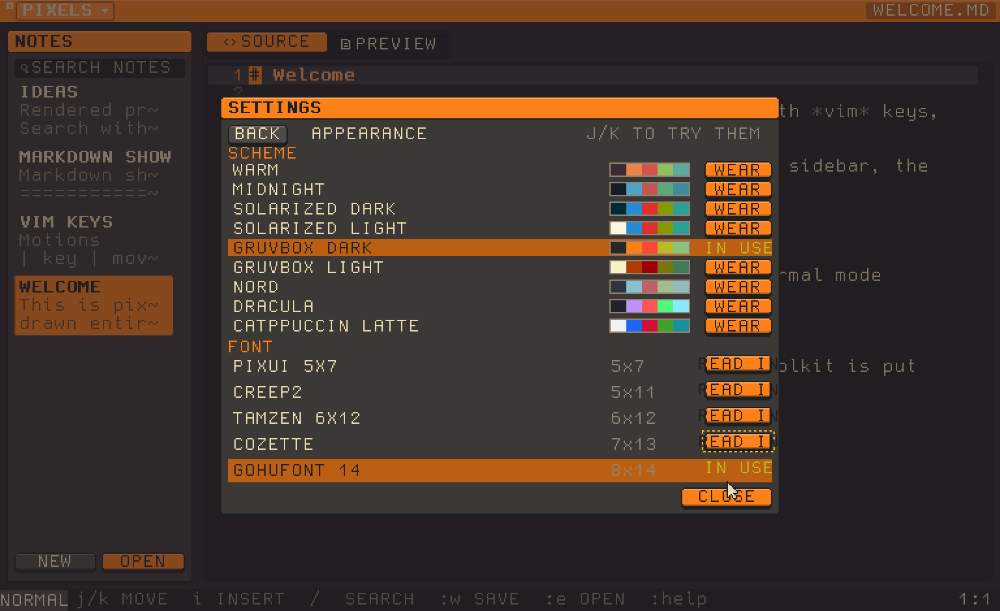 |

## Built on pixui

`pixui/` is the toolkit underneath: a software rasteriser, a 5x7 bitmap font,
an immediate-mode widget set, floating layers, and a swappable presenter with
CPU (softbuffer) and GPU (wgpu) backends. It draws a frame when there is a
reason to and not otherwise: a spring in flight or a blinking caret keeps a
clock running, and a window sitting still costs nothing to sit still.

It also knows how to get out of its own way. The model runs on the same GPU the
window is drawn on, and a Metal command buffer runs to completion — so a frame
arriving behind a chunk of the question waited for all of it, and the window
fell to 15 frames a second with 400ms gaps. `Ui::share_gpu` says *something else
needs this more*, and the presenter answers by drawing on the CPU instead: not
faster, 11ms a frame against 1.5ms, but not in the queue. 85 frames a second
through the same work. It is given up once and not taken back, because a window
softbuffer has drawn on never accepts wgpu again — every acquire after that
comes back occluded, which looks exactly like a hang.

It is a path dependency of this app rather than the point of the repo, and
`pixui/README.md` covers it properly.

```sh
cargo run --release -- --shots      # regenerate screenshots/
cargo test --workspace              # 316 tests, 413 with both backends
tools/e2e.sh                        # the whole app, against the real model
PIXUI_PROFILE=1 cargo run --release # live frame breakdown
```

`tools/e2e.sh` is the one that needs weights. It drives the application with no
window — typing into the editor, opening a conversation, clicking the buttons
the model's answers put on screen — and then looks at the vault on disk to see
whether what was asked for actually happened. Everything runs in a sandbox made
for the run and thrown away after, with its own settings, so it cannot touch the
notes you keep. `tools/e2e.sh Ornith` picks a model by name and
`E2E_ONLY="turned down" tools/e2e.sh` runs one scene.

The scenes are the things people actually do: a note typed by hand and saved,
a question that needs a tool, a file the model writes and you accept, several
tools from one question, a change turned down with the vault checked unmoved, a
conversation about birthdays ending in a note of them, a passage rewritten in
the editor, and the transcript found on disk afterwards.

It tells two kinds of failure apart, because they mean different things. A
button that is not there, a question that never went, a file not written after
the change was accepted — those are this code, and they set the exit status. An
answer that is simply wrong is a model having a poor day, and is reported
without failing the run. Nearly everything it has caught so far was the first
kind: a change block the model wrapped in a tool call and lost, a reply that
came back empty, and a model marking its own change as already accepted.

The model is built in by default, which means a first build compiles llama.cpp
and wants `cmake` and `clang`. `--no-default-features` leaves it out, and the
assistant becomes a stub that fixes typos. `PIXUI_MODEL` and `PIXUI_MODELS`
move the weights, `PIXUI_CONFIG` moves the settings file, and
`PIXUI_LLAMA_LOGS` lets llama.cpp narrate when something has gone wrong.

```sh
echo "teh meeting was ok" | cargo run --release -- --ask "fix the typos"
```

## Not implemented

Marks, macros, named registers (the unnamed one is the system clipboard),
regular expressions in search (patterns are literal), tag objects, inline and block HTML, footnotes, definition lists,
character entities, and any script the built-in ASCII font cannot draw. Images
are parsed but cannot be drawn, so their alt text stands in for them.

Why any of it is built the way it is lives in the code, next to the code.

## Licence

MIT OR Apache-2.0
